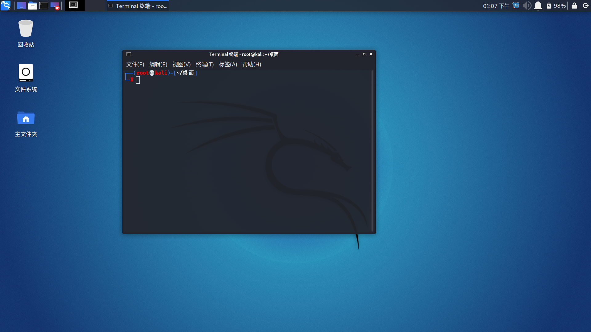
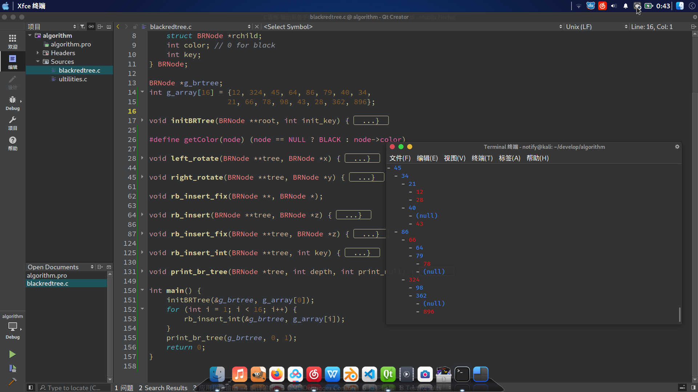

# 定制自己的桌面环境

> [主页](../README.md) > [Linux](index.md) > #1

___

最近实装了Kali Linux系统。系统自带的桌面环境是xfce4，使用体验尚可，不过我现在在用KDE。中间自然是把各种桌面环境都试了一下：

## Xfce

> （复制自百度百科）\
> Xfce是一个轻量级的类Unix的桌面系统，Xfce这个词的发音为X-f-c-e(即四个字母一个一个的读）。\
> 关于Xfce的设计目的， 它的创始人Olivier Fourdan描述为： “快速加载并用来执行程序，且占用系统资源少" 。\
> Xfce 是一款适用于多种 *NIX 系统的轻量级桌面环境。它被设计用来提高您的效率，在节省系统资源的同时，能够快速加载和执行应用程序。\
> Xfce 是一个有很长历史的的桌面环境项目了，在很多Linux 中可以见到它的身影。

Kali自带的Xfce已经很好康了:

当然还可以自己把它折腾成如同Mac一般（低仿）:

具体折腾方式可以看[这里](https://blog.csdn.net/qq_43901693/article/details/103102528)。

点[这里](https://www.xfce-look.org/)下载自己喜欢的xfce主题。

我的笔记本电脑满电情况下能运行xfce四小时左右。

## Gnome

界面挺不错，但是发现Ctrl+Alt+T不能打开终端后我就没折腾了。

## LXDE、LXQT

界面跟Win95差不多，树莓派可以考虑用用，我反正点进去看看就把它们立刻卸了。

## KDE

kde自然是比xfce更好：首先，它能够续航六小时；其次，它的可定制性比xfce更强；然后它特效更丰富；最后它还带有很多不错的软件。[KDE官网](https://kde.org)

顺便kde对wine应用的支持也比xfce更好。QQ和微信可以接近完美的运行。

贴张截图：

## 没有桌面环境

无疑是最最省电的。不过大可不必把桌面环境都卸了，按Ctrl+Alt+F1就可以进入，然后手动杀掉桌面进程就行。

按Ctrl+Alt+F7可以返回桌面（如果你没杀掉这个进程的话）

___

顺便再推荐一些图形界面软件或者和开发没什么关系，因为以后写的关于Linux的博客都是基于终端的了：

这些软件通常存在于apt源内：

> gimp（Linux下的Photoshop）\
> kdenlive （Linux下的Premiere）\
> audacity （Linux下的Audition）\
> blender （3D建模软件，但我不会建模）\
> aegisub （字幕制作软件）\
> krita （数位板绘画软件，但我不会画画）\
> vlc （几乎万能的播放器，还能录屏）\
> simplescreenrecorder （不过真要录屏的话请选这个）\
> ffmpeg （不必多说）\
> you-get （在pip下安装，可以下载b站视频）\
> kdeconnect （电脑手机互联）\
> scrcpy （一根数据线实现电脑控制手机屏幕）\
> stacer （如同电脑管家一般的小软件）

下列软件在官网提供deb包下载:

> vscode \
> wps \
> netease-cloud-music （网易云音乐）\
> baidunetdisk （百度网盘）\
> vmplayer

___

下一篇：[初访终端](console.md)
