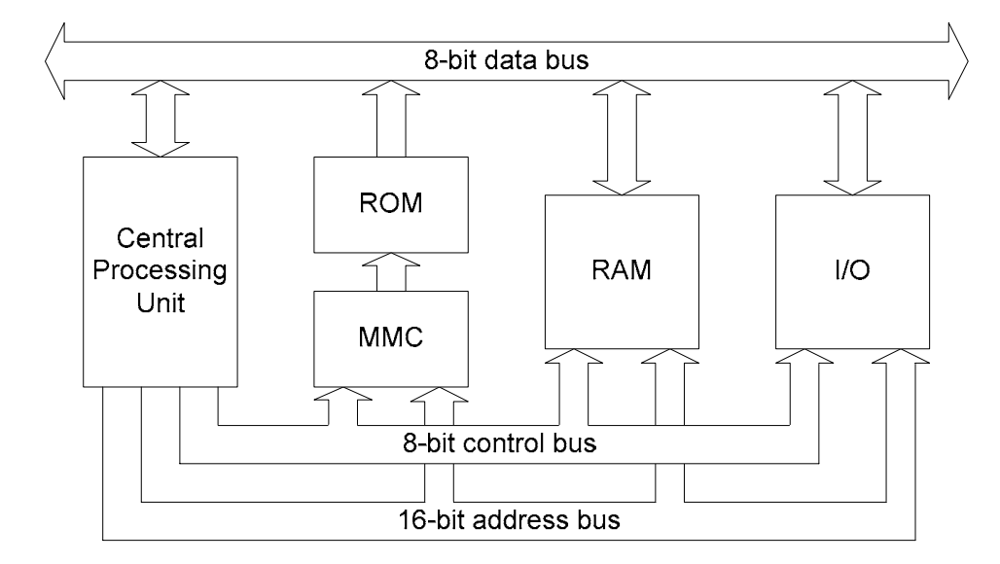
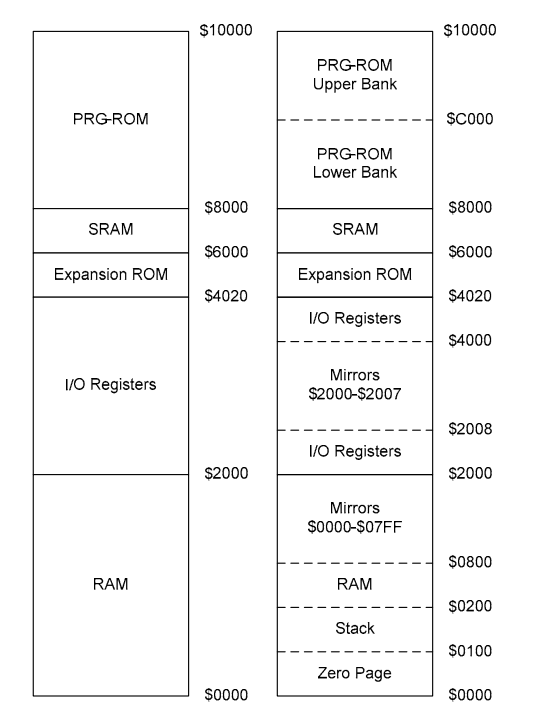
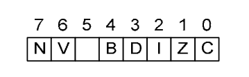

# CPU

> [主页](../README.md) > [Nes](index.md) > #3

___

（以下内容翻译自nesdev.pdf，以后很多东西都是从那里来的，当然我自己也会穿插一些乱七八糟的话进去，一些陌生名词会在后面说到）

（翻译文档估计也算汉化罢 23333）

- [CPU](#cpu)
  - [2A03总览](#2a03总览)
  - [CPU的内存映射](#cpu的内存映射)
  - [寄存器](#寄存器)
    - [程序计数器（PC）](#程序计数器pc)
    - [栈指针（SP）](#栈指针sp)
    - [累加器（A）](#累加器a)
    - [变址寄存器 X（X）](#变址寄存器-xx)
    - [变址寄存器 Y（Y）](#变址寄存器-yy)
    - [状态寄存器（P）](#状态寄存器p)
  - [中断](#中断)

## 2A03总览

NES使用CPU的型号是2A03，8bit，工作频率 1.7897725 MHz。2A03基于标准6502，增加了声音处理功能（相当于内嵌了个声卡？）顺便这个CPU遵循小端序，也就是说一个数字的较高位存储在更高的地址。比如0x12345678被存储为78 56 34 12（地址依次增加）。

## CPU的内存映射

上边的图展示了CPU通过总线访问内存的方法。整个内存被分为三部分：卡带中的ROM，CPU的RAM和I/O寄存器。地址总线（address bus）用于设置所需位置的地址。 控制总线（control bus）用于通知组件请求是读取还是写入。数据总线（data bus）用于将字节读取或写入指定地址。注意，ROM是只读的，可以通过MMC进行访问，以允许进行存储区切换。 I/O寄存器用于与系统的其他组件、PPU以及控制设备进行通信。

2A03拥有16位地址总线，因此可以寻址从\$0000-\$FFFF（在6502汇编中，将\$加在数字前面表示这是16进制数）一共64KB的内存。但是CPU的实际RAM只有2KB。下边的图就是NES的内存映射方式，左边的部分用简化的方式展示了主要的几个部分，右边则把那几部分划分的更加详细。

零页（Zero Page）表示从\$0000-\$00FF区域的内存，它也是内存的第一部分，在零页中读写信息比其他区域更加快一点。\$0800-\$1FFF是\$0000-\$07FF的镜像，一共镜像三次。（所谓镜像就是原样复制下来，比如存放在\$0000、\$0800、\$1000、\$1800的数据始终一致，而且保持同步更新。）\$2000-\$401F是I/O寄存器所在的区域，其中\$2008-$3FFF都是\$2000-\$2007的镜像。（这镜像的次数也太多了吧= =b）SRAM（或者WRAM）是电池存档使用的区域。

从\$8000一直到后面是卡带的PRG-ROM区域。如果卡带的PRG-ROM只有16KB的话，就在两个区域都存放，或者说镜像。拥有2个16KB PRG-ROM的游戏会将它们分别载入到\$8000和\$C000。如果卡带的PRG-ROM还要更多的话，卡带将使用Mapper来决定将哪些段载入到内存中。

## 寄存器

6502有6个寄存器：PC、SP、A、B、X、P。

### 程序计数器（PC）

唯一的16位寄存器，用来存放CPU将要执行的下一条指令的地址。指令执行的时候，PC的值会更新至下一条指令的地址。PC的值会被跳转指令、过程调用和CPU中断影响。

### 栈指针（SP）

或者说S寄存器。

NES的栈空间位于内存中的\$0100-\$01FF，以\$01FF为栈底的地址并向下增长。SP是一个8位寄存器（之后的寄存器都是8位的），用来表示栈顶指针的值，其具体值是栈顶地址到\$0100的偏移。（栈空间才256字节啊，NES上果然是寸土寸金）NES中没有检测栈溢出的措施，并且SP的值只会在\$00-\$FF循环。

### 累加器（A）

存放算术运算和逻辑运算结果的寄存器，可以读写内存。（其地位堪比x86汇编中的eax，6502汇编中的很多指令都是和A相互操作的。）

### 变址寄存器 X（X）

用来辅助A或者存放偏移值的寄存器。在一些特定的寻址场合可以起到作用。可以读写内存。

### 变址寄存器 Y（Y）

和X几乎一样，但是Y不能影响SP的值（没有那种指令）。

### 状态寄存器（P）

存放了8个二进制位，称为状态位。这些位可以被一些指令影响，也可以影响一些指令的执行情况。

- 进位（Carry flag, C）：上一次加法运算/减法运算如果发生了进位/退位，C状态位就被设为1，否则设为0。例如\$F+\$1=\$10，同时C位被设为1。这个位可以帮助CPU做超出8位数的运算。
- 零位（Zero flag, Z）：上一次运算结果是否为0。
- 中断禁用位（Interrupt Disable, I）：将这个位设为1可以使系统无视IRQ中断。
- 十进制状态位（Decimal flag, D）：将这个位设为1可以使6502进入十进制模式（二进制编码的十进制， Binary Coded Decimal，BCD，例如255在BCD模式下是%001001010101，即4个二进制位表示一个十进制位）。但是我们2A03不支持BCD，所以设置了也没有用处。
- 中断位（Break Command, B）：brk指令被执行时设置，产生一个IRQ中断。
- 未使用位：值永远为1，FCDebug中把这个位称为R位。
- 溢出位（Overflow flag, V）：上一次运算发生数位溢出的话就被设置，比如64+64=-128的时候。简单来说就是正正得负或者负负得正时被设置，更具体的，V = (bit6 AND bit7) XOR (C & bit7)
- 负数位（Negative flag, N）：上一次运算结果是否为负数，即符号位是否为1。

## 中断

中断阻止代码继续以标准顺序执行，并使CPU处理该中断。它通常由值得注意的硬件产生，但也可以由软件触发。NES具有三种不同类型的中断：NMI、IRQ和复位。发生中断时跳转到的地址存储在程序代码的向量表中\$FFFA-\$FFFF处。发生中断时，系统执行以下操作：

1. 确认到中断被触发。
2. 完成当前指令的执行。
3. 将PC和状态寄存器入栈。
4. 设置中断禁用位以防处理中断时又接到新的中断。（套娃？）
5. 把中断处理程序的地址从向量表加载到PC中。
6. 运行中断处理程序。
7. 当RTI指令运行完后，从栈中弹出PC和状态寄存器。
8. 继续运行程序。

IRQ，或者说可屏蔽中断，是由某些内存映射器产生的。如果中断禁用位被设置了的话，CPU就会忽略它们。发生IRQ时，系统跳转到存放在\$FFFE和\$FFFF的地址（注意小端序）。

NMI（Non-Maskable Interrupt，不可屏蔽中断）是在每个帧的末尾出现V-Blank时，PPU生成的中断类型。NMI不受状态寄存器中的中断禁止位的影响，因此，执行时总是会中断执行。但是，如果PPU控制寄存器1（\$2000）的第7位清零，就可以防止NMI的触发。当发生NMI时，系统跳至\$FFFA和\$FFFB的地址。

复位中断在系统启动或者按下复位键时被触发。发生复位中断时系统跳转到\$FFFC和\$FFFD的地址。复位中断的处理优先级最高，NMI其次，IRQ最低。

___

上一篇：[码表与文本导出](tbl.md)

下一篇：[6502汇编](6502.md)
