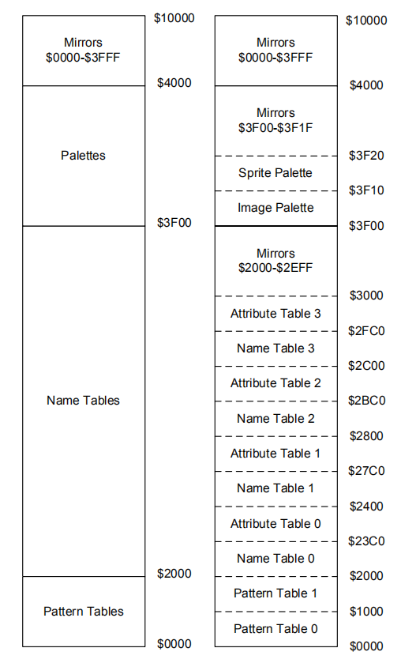
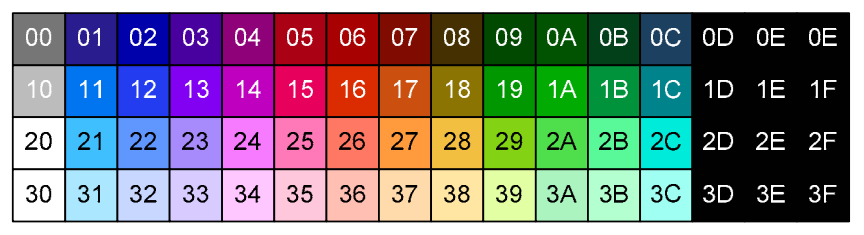
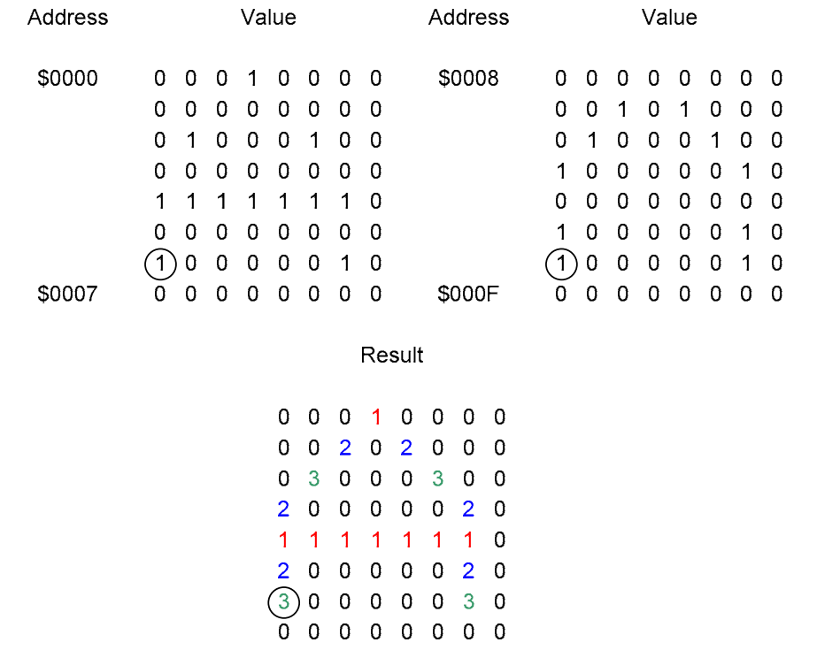
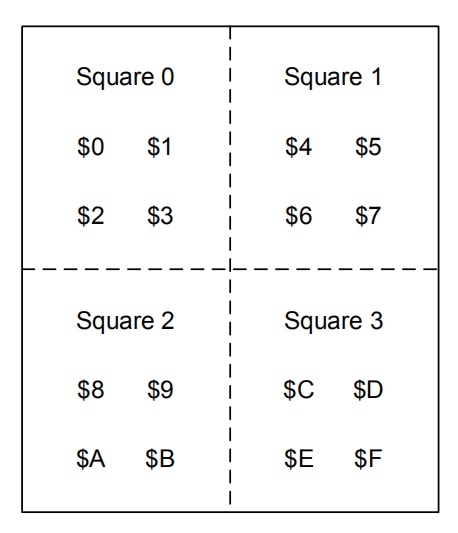

# PPU

> [主页](../README.md) > [Nes](index.md) > #5

___

- [PPU](#ppu)
  - [2C02](#2c02)
  - [PPU的内存映射](#ppu的内存映射)
  - [PPU的寄存器](#ppu的寄存器)
    - [DMA](#dma)
  - [调色板](#调色板)
  - [模块表](#模块表)
  - [命名表和属性表](#命名表和属性表)

## 2C02

PPU（Picture Process Unit，图像处理器），型号为2C02。它的寄存器映射到CPU地址空间内的\$2000-\$401F。

## PPU的内存映射

PPU拥有自己的内存，称为VRAM（Video RAM），大小为16KB。同时PPU也具备64KB的寻址能力。其内存映射方式如图。

可以看出实际只使用前16KB（毕竟VRAM就这么大），后面48KB都是这16KB的镜像。

我们可以使用CPU内存空间中的I/O寄存器$2006和$2007来读写PPU内存。通常在帧末尾的V-Blank期间执行此操作，因为它会影响绘制屏幕时使用的地址，因此可能会破坏显示的内容。但此效果可用于产生分屏效果。

> 所谓V-Blank就是显示线渲染完成之后的那一段时间。

由于PPU存储器使用16位地址，而I/O寄存器仅为8位，因此需要两次写入\$2006来设置所需的地址。然后可以从\$2007读取数据或将数据写入\$2007。在每次写入\$2007之后，该地址将按照$2000的第2位指示增加1或32。从\$2007进行的第一次读取无效，并且数据实际上将被缓冲并在下一次读取时返回。不适用于调色板。

## PPU的寄存器

CPU和其他设备之间的通信通过内存映射中的I/O寄存器实现。PPU使用的几个寄存器位于主存中的\$2000-\$2007，此外还在\$4014处提供了一个附加寄存器用来直接寻址（Direct Memory Access, DMA）。I/O寄存器之后还会新开一篇进行更详尽的介绍。

CPU可以通过写$2000和$2001，分别称为PPU控制寄存器1和PPU控制寄存器2来控制PPU的动作。两个寄存器都是只写的。$2000的第7位可用于禁用NMI。请记住，每当发生V-Blank时，都会产生这种类型的中断，并且不受状态寄存器的中断禁止标志的影响。清除该位将防止在V-Blank上发生NMI。由于NES支持8x8和8x16精灵，因此将$2000的第5位设为1可以启用8x16精灵模式。每个I/O发生后，PPU存储器中要读取或写入的下一个地址将增加。通过设置$2000的第2位值来调整要增加的值。如果清除，地址将增加1（水平），否则增加32（垂直）。对于$2001，可以通过清除位3来隐藏背景，类似地，可以通过清除位4来隐藏精灵。

PPU状态寄存器位于$2002且为只读。PPU使用该寄存器将其状态报告给CPU。这些程序经常会导致CPU从该位置读取数据，以确定PPU的状态。PPU设置的位7指示正在发生V-Blank。位6和位7与精灵有关，将在后面进行描述。位4指示PPU是否愿意接受对VRAM的写入，如果清除则将忽略写入。当发生从$2002的读操作时，第7位和$2005和$2006一样复位为0。

### DMA

在设备之间传输大量数据时，通过处理器传输数据效率很低。例如，要将数据从CPU内存传输到SPR-RAM，需要执行以下步骤：

1. 将所需的SPR-RAM地址加载到CPU中。
2. 将所需的SPR-RAM地址写入$2003。
3. 将字节加载到CPU。
4. 将字节写入$2004。

填充SPR-RAM的内容时​​，必须重复这几步256次。直接内存访问（DMA）是一种允许将数据从CPU内存更有效地复制到Sprite内存的技术。使用DMA，可以通过一条指令（写入$4014）来填充整个子画面存储器。CPU存储器中的起始地址由写操作数乘以$100指定。从该地址开始的256个字节被直接复制到Sprite存储器中，而无需CPU的进一步参与。

发生DMA时，正在使用内存总线，从而阻止了CPU访问内存，从而阻止了CPU访问更多指令。这被称为周期窃取，CPU必须等待DMA传输完成。在NES上，DMA需要花费512个周期（相当于4.5条扫描线），之后CPU才能恢复。这比通过CPU手动复制所需的时间要少得多。

## 调色板

NES的调色板包含52种颜色，尽管实际上的空间是64。

但是，并非所有这些颜色都可以在同一时间显示。NES使用两个调色板，每个调色板有16包含16种颜色，图像调色板（$3F00-$3F0F）和精灵调色板（$3F10-$3F1F）。图像调色板显示了当前可用于背景图块的颜色。子画面调色板显示当前可用于子画面的颜色。这些调色板不存储实际的颜色值，而是存储系统调色板中颜色的索引。由于仅需要64个唯一值，因此可以忽略位6和7。

$3F00处的调色板条目是背景色，用于透明度。使用镜像是为了使调色板中的每四个字节都是$3F00的副本。因此，$3F04，$3F08，$3F0C，$3F10，$3F14，$3F18和$3F1C只是$3F00的副本，每个调色板中的颜色总数为13，而不是16。因此，任何时候屏幕上的颜色总数为52种颜色中的25种。两个调色板也都映射为$3F20-$3FFF。

## 模块表

NES有两个模块表，分别位于VRAM的$0000和$1000。模块表存储可以在屏幕上绘制的8x8像素图块，称为Tile。许多游戏将模块表存储在卡带上的CHR-ROM中，但是，没有CHR-ROM的游戏将使用RAM作为模块表并在执行过程中填充它们。模块表存储标识该像素使用的图像或精灵调色板条目所需的4位数字的最低有效两位。（也就是说单个Tile只能表示4种颜色）

举个例子：

## 命名表和属性表

命名表实际上是Tile编号的矩阵，而Tile编号对应了模块表中保存的各个Tile。命名表保存着32x30的Tile，由于每个Tile是8x8像素，因此整个命名表是256x240像素。

每个命名表都有一个关联在一起的属性表。属性表保存着Tile颜色的高2位。属性表中每个字节代表一个4x4Tile组（如下图），而属性表总长64字节，刚好够表示出命名表中所有的2x2Tile组的配色情况。字节的布局是33221100，其中每两位指定正方形区域的高二位配色。（回想一下，低二位颜色存放在模块表的每个Tile中。显然每个2x2Tile区域只能显示4种颜色，这也是NES做不出十分绚丽的画面的原因之一。）

（待续）

___

上一篇：[6502汇编](6502.md)

下一篇：[卡带](pak.md)
