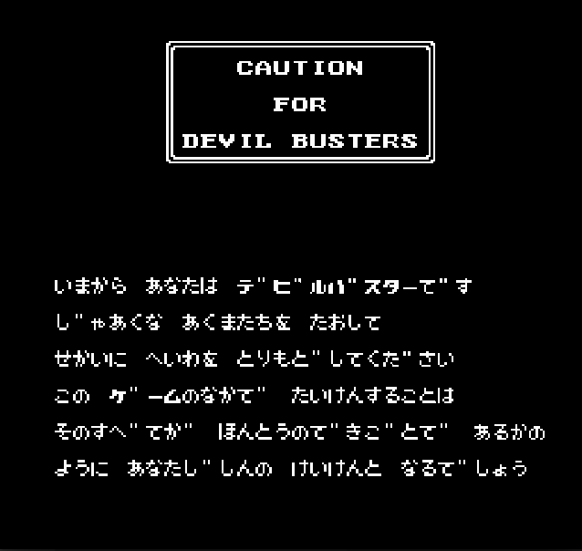
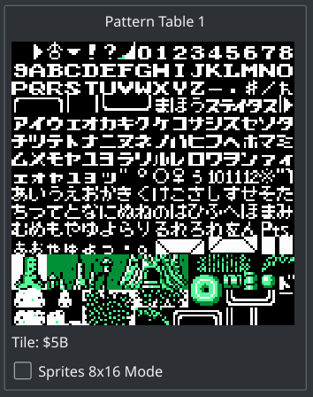
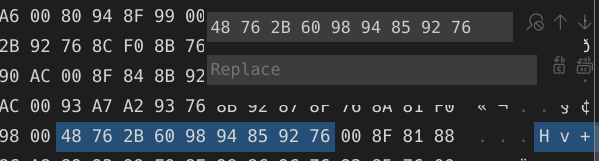

# 码表与文本导出

> [主页](../README.md) > [Nes](index.md) > #2

___

通过观看上一篇链接里面拿到的教程以及[romhacking.net](http://romhacking.net)网上冲浪，我了解到了汉化的基本步骤，大概就是导出文本修改之再导回去？但愿是这样，以前我还没弄过汉化这一行...

用模拟器加载ROM，可以看到游戏内全是假名，那么这个游戏估计是单字节编码一个字。



（图里面开了个PPU查看器，虽然还不知道PPU是啥）

根据教程我们要想办法弄出这个游戏对应的码表，但是我没完全按照教程来，我（碰运气）点开了PPU查看器：



截这个图的时候鼠标停在“フ”上面，下面的Tile值显示为5B，于是猜测PPU里面的编码可能就和一个个假名对应？那试试看呗，从上面的截图里面随便找段话：

```txt
ケ"—ムのなかて"
```

对应一下猜测的编码就是：

```txt
48 76 2B 60 98 94 85 92 76
```

如果这段编码能在ROM中找到的话，就说明猜测的编码方式是对的，同时也说明ROM的文本未经压缩，这样的话汉化的可行性说不定会提高不少。总之用16进制编辑器打开ROM搜索这段编码看看。



运气不错呢，猜对了。感觉汉化这个ROM确实有可行性了。总之根据那边PPU查看器的提示制作出了一份码表，然后通过工具顺利提取出了所有文本（23333）。

如果是英化ROM的话翻译好文本然后直接导入就行了（大概吧），但是汉化面对的问题比较多，比如汉字数量超过255之类的，而且我想搞大字体汉化（一上来就这么弄真的大丈夫吗），查了查大字体汉化教程，几乎只能查到一篇，而且我还不怎么看得懂，于是乎...得好好研究一下这个游戏机了。

我们毕竟不用写一个nes模拟器出来，所以对它的硬件有初步了解就行了（大嘘），接下来就是啃nesdev的英文资料了...

___

上一篇：[准备工作](preparation.md)

下一篇：[CPU](cpu.md)
